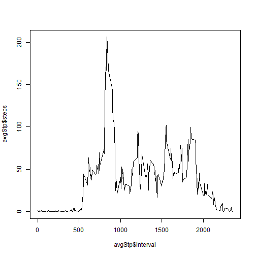
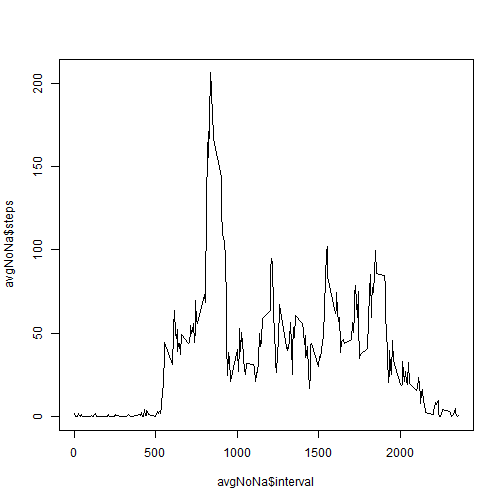

---
title: "Reproducible Research: Peer Assessment 1"
output: 
  html_document:
    keep_md: true
---


## Loading and preprocessing the data


```r
setwd("C:\\Users\\Automation\\Documents\\R\\RepData_PeerAssessment1")
unzip("activity.zip")
dataStep <- read.csv("activity.csv")

aggSum <- aggregate(steps ~ date, data = dataStep, FUN = sum)
hist(aggSum$step, 53, main = "Steps per day", xlim = c(0,25000))
```

 

```r
mean(aggSum$steps)
```

```
## [1] 10766.19
```


## What is mean total number of steps taken per day?

```r
meanStep <- mean(aggSum$step)
medianStep <- median(aggSum$step)

meanStep
```

```
## [1] 10766.19
```

```r
medianStep
```

```
## [1] 10765
```


## What is the average daily activity pattern?

```r
avgStp <- aggregate(steps ~ interval, data = dataStep, FUN = mean)
plot(avgStp$interval, avgStp$steps, type = "l")
```

 

```r
maxStp <- avgStp[max(avgStp$steps),1]
maxStp
```

```
## [1] 1705
```

## Imputing missing values
1. Calculate and report the total number of missing values in the dataset
(i.e. the total number of rows with NAs)

```r
sum(is.na(dataStep))
```

```
## [1] 2304
```

2. Devise a strategy for filling in all of the missing values in the dataset. The
strategy does not need to be sophisticated. For example, you could use
the mean/median for that day, or the mean for that 5-minute interval, etc.

I decided to replace the missing values with the average values of the interval
missing. This strategy stabilizes the mean and makes the median also closer
to the mean.

3. Create a new dataset that is equal to the original dataset but with the
missing data filled in.

```r
dataNoNa <- dataStep
for (i in 1:dim(dataNoNa[1])) {
        if (is.na(dataNoNa[i,1] == TRUE)) {
                dataNoNa[i,1] <- avgStp[avgStp$interval == dataNoNa[i,3],2]
                }
}
```

```
## Warning in 1:dim(dataNoNa[1]): numerical expression has 2 elements: only
## the first used
```

```r
avgNoNa <- aggregate(steps ~ interval, data = dataNoNa, FUN = mean)
```

4. Make a histogram of the total number of steps taken each day and Calculate
and report the mean and median total number of steps taken per day. Do
these values differ from the estimates from the first part of the assignment?
What is the impact of imputing missing data on the estimates of the total
daily number of steps?

```r
plot(avgNoNa$interval, avgNoNa$steps, type = "l")
```

 

```r
aggNoNa <- aggregate(steps ~ date, data = dataNoNa, FUN = sum)
hist(aggNoNa$step, 53, main = "Steps per day no Na", xlim = c(0,25000))
```

 

```r
stepsDayNoNa <- aggregate(steps ~ date, data = dataNoNa, FUN = sum)
meanNoNa <- mean(stepsDayNoNa$step)
medianNoNa <- median(stepsDayNoNa$step)
meanNoNa
```

```
## [1] 10766.19
```

```r
medianNoNa
```

```
## [1] 10766.19
```


Since I decided to use the average amount of step per interval to substitue NA 
values, the average doesn't change due to the very definition of mean. The 
median however increases slightly to match the average.  

## Are there differences in activity patterns between weekdays and weekends?

```r
library(scales)
library(ggplot2)
library(grid)
library(gridExtra)
dataNoNa$weekday <- as.character(weekdays(as.Date(dataNoNa$date)))
dataNoNa$weekday[dataNoNa$weekday == "Monday"] <- "Weekday"
dataNoNa$weekday[dataNoNa$weekday == "Tuesday"] <- "Weekday"
dataNoNa$weekday[dataNoNa$weekday == "Wednesday"] <- "Weekday"
dataNoNa$weekday[dataNoNa$weekday == "Thursday"] <- "Weekday"
dataNoNa$weekday[dataNoNa$weekday == "Friday"] <- "Weekday"
dataNoNa$weekday[dataNoNa$weekday == "Saturday"] <- "Weekend"
dataNoNa$weekday[dataNoNa$weekday == "Sunday"] <- "Weekend"
dataNoNa$weekday <- as.factor(dataNoNa$weekday)
WeekAvg <- aggregate(steps ~ interval + weekday, data = dataNoNa, mean)

time <- cbind(WeekAvg$interval%/%100, WeekAvg$interval-(WeekAvg$interval%/%100)*100)
time <- as.data.frame(time)
time2 <- ISOdatetime(2015, 01, 01, time$V1, time$V2, 00)
WeekAvg$time2 <- time2

wkd<-WeekAvg[1:288,]
wke<-WeekAvg[288:576,]
pwe <- ggplot(wke, aes(x=time2, y = steps)) + geom_line (size = 1) + scale_x_datetime(labels = date_format("%H:%M"),breaks = "2 hour") + theme (axis.text=element_text(size=8))+ xlab("Hour")
pwd <- ggplot(wkd, aes(x=time2, y = steps)) + geom_line (size = 1) + scale_x_datetime(labels = date_format("%H:%M"),breaks = "2 hour") + theme (axis.text=element_text(size=8))+ xlab("Hour")
grid.arrange(pwd, pwe, ncol = 1, main = "Weekday vs Weekend trend")
```

 
